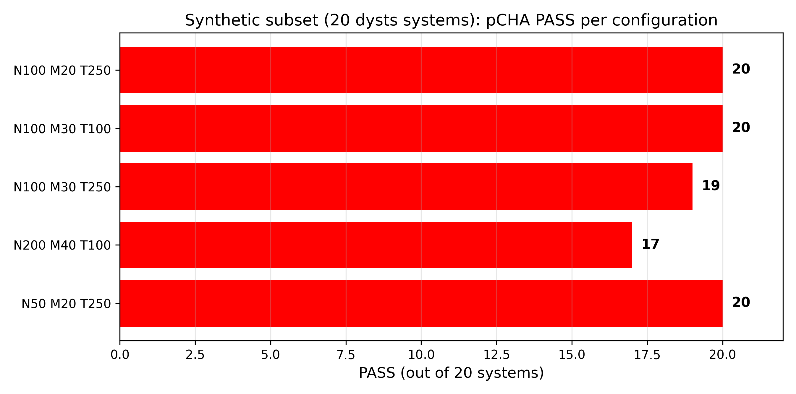
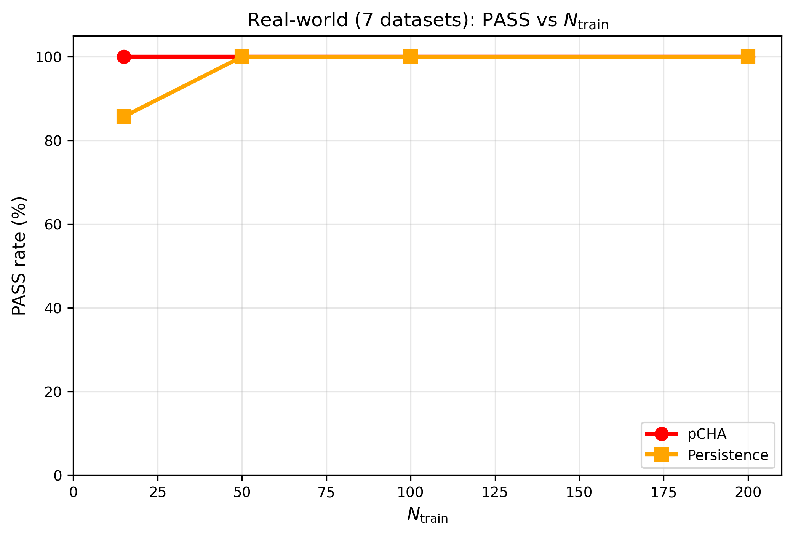

# pCHA

*p-adic Categorical Hyperchaos Approximation*

pCHA forecasts chaotic systems when training data is scarce. It takes 
about 15 data points, with no access to the underlying equations, and 
reconstructs trajectories out to 50 Lyapunov time units. The method is 
formulated in a p-adic ultrametric state space and organized categorically. 
The implementation is closed. Verification is open.

---

## Results

### dysts benchmark (117 systems)

At n_train = 200, T = 50 Lyapunov units, strict out-of-sample hold-out.

**Evaluated on 95th-percentile error (p95):**

| threshold | pCHA | Persistence | NeuralODE | SINDy |
|-----------|------|-------------|-----------|-------|
| ε = 0.1   | **99.15%** | 97.44% | 97.44% | 22.22% |
| ε = 0.01  | **99.15%** | 81.20% | 79.49% | 1.71% |
| ε = 0.001 | **95.73%** | 13.68% | 13.68% | 0% |

**Evaluated on maximum error (max):**

| threshold | pCHA | Persistence | NeuralODE | SINDy |
|-----------|------|-------------|-----------|-------|
| ε = 0.1   | **99.15%** | 97.44% | 97.44% | 14.53% |
| ε = 0.01  | **98.29%** | 46.15% | 44.44% | 0% |
| ε = 0.001 | **79.49%** | 11.97% | 11.97% | 0% |

All other ML baselines (EDMD, ESN, LinearStateMap, MLP, NVAR, Transformer)
are at 0% at all three thresholds in both evaluations.

Numbers: `results/dysts_full_p95_error.csv` and `results/dysts_full_max_error.csv`.


### Synthetic sweep

20 representative systems, n_train from 15 to 200. pCHA stays at 100% 
PASS the whole way, median max error under 6e-4. Persistence drops to 90% 
at n_train = 15. All the other baselines are at 0% throughout.

I also ran pCHA alone below 15 - down to n_train = 5 - without baseline 
comparison. It stays at 100% PASS with bounded error, no divergence, no 
NaN. Since I didn't test baselines at these sizes, I'm not making a 
comparison claim there.

Numbers: results/synthetic_N100_M20_T250.csv (and four other configs).



### Real-world data

Seven datasets - SantaFe laser, OMNI, AAPL, MSFT, GOOGL, SPY, ECG. 
At ε = 0.1σ, pCHA passes all seven. At ε = 0.01σ, six of seven; MSFT is 
the one that fails. The ML baselines don't pass anything.

Numbers: results/real_world_summary.csv and results/real_world_results.csv.



### HyperRossler (4D hyperchaos)

pCHA is the **only** method that passes HyperRossler at all three thresholds
(ε = 0.1, 0.01, 0.001). 
All 9 baselines - Persistence, SINDy, EDMD, NVAR,
LinearStateMap, ESN, MLP, Transformer, NeuralODE - fail.

### Long-horizon (T = 9900, 9.9 million steps)

pCHA maintains bounded error across 9.9M steps:

| system | dim | max error |
|--------|-----|-----------|
| mackeyglass_10d | 10 | 6.73e-08 |
| nuclearquadrupole_4d | 4 | 5.76e-06 |
| hypercai_4d | 4 | 2.11e-05 |
| lorenz | 3 | 3.84e-05 |
| chen | 3 | 2.14e-04 |

Numbers: `results/long_horizon_T9900.csv`.

---

## Scope

**Works for:**

- deterministic, bounded, continuous-time systems
- smooth or piecewise-smooth flow
- 1D–3D series directly; higher via standard delay embedding
- stationary or quasi-stationary data

### Out-of-scope (documented boundaries)

| domain | type | reason |
|--------|------|--------|
| ChaosNetBench-CML | discrete map | not continuous flow |
| MGAB | 1D scalar DDE | SINDy outperforms |
| Streamflow | stochastic, non-stationary | - |
| KF256 Re=5000 | 2D turbulence | 3D-POD = 56.6% energy |

pCHA doesn't solve chaos forecasting in general. It works well on the 
class of problems above. Outside that class, I make no claims.

One documented in-scope failure: ScrollDelay, a delay-differential system 
with a discontinuous nonlinearity. Median max error 0.52 at n_train = 200. 
I'm reporting it as-is, because it marks where the method stops working.

---

## Verification

I don't publish the source. I do accept blind tests.

The rules are in `blind_test_protocol.md`. The short version:

- verifiers are picked by the community, not by me
- I have no veto over who gets picked
- submissions are processed first-come, first-served inside the declared scope
- every submission gets logged publicly
- every result is published - positive or negative
- metric, thresholds, and scope are fixed before any test arrives

The protocol is the only document that governs verification. This README 
doesn't override it.

Separate channel for commercial evaluation under NDA. It doesn't affect 
the public one. Contact below.

---

## What's open, what's closed

**Open:**

- `theory.md` - the mathematical framework
- `blind_test_protocol.md` - verification terms
- `results/` - all aggregated CSV data
- `results/figures/` - all six figures as PNG and PDF

**Closed:**

- the choice of prime p and its precision
- the p-adic embedding
- the construction of the categorical structure C_p
- the morphism-extension algorithm
- the numerical implementation

The core implementation is proprietary and remains closed. Instead of 
open-sourcing the code, I've focused on making the claims fully verifiable 
through the blind-test protocol. A method can be worth taking seriously 
without being open source - the question is whether its claims can be 
checked.

---

## Repository

```text
pCHA/
├── README.md
├── theory.md
├── blind_test_protocol.md
└── results/
    ├── dysts_summary_multi_threshold.csv
    ├── real_world_benchmarks.csv
    ├── synthetic_n_train_summary.csv
    ├── real_world_n_train_summary.csv
    └── figures/
        ├── fig1_wall_of_chaos.png / .pdf
        ├── fig2_ecg_precision.png / .pdf
        ├── fig3_domain_coverage.png / .pdf
        ├── fig4_all_datasets_precision.png / .pdf
        ├── fig5_pass_vs_ntrain.png / .pdf
        └── fig6_error_vs_ntrain.png / .pdf
```

No source code or binaries.

---

## Benchmark conditions

Same setup for every method:

- state: 3D, or 1D–3D via embedding
- n_train for the baseline comparison: {15, 50, 100, 200}
- n_train for the pCHA-only threshold study: {5, 10, 15}
- horizon: T = 50 Lyapunov time units
- strict out-of-sample hold-out
- zero RHS (no equations given to any method)
- no future leakage
- metric: max L2 error
- thresholds: ε ∈ {0.1σ, 0.01σ, 0.001σ}, σ from the test split

Baseline hyperparameters come from the original papers, no tuning on 
test. If a pre-registered validation split is provided, baselines can be 
tuned on validation and frozen before evaluation; test stays untouched. 
Details in `blind_test_protocol.md` §10.

---

## Contact

**email:** vallais.aet@proton.me
**telegram:** @vallais_one
**X:** @VallaisOne

For verification enquiries, community nominations, commercial evaluation.

Nominations and submissions go through `blind_test_protocol.md`, not 
through this README.

---

*If there's any discrepancy between this README and the protocol, 
follow the protocol.*
