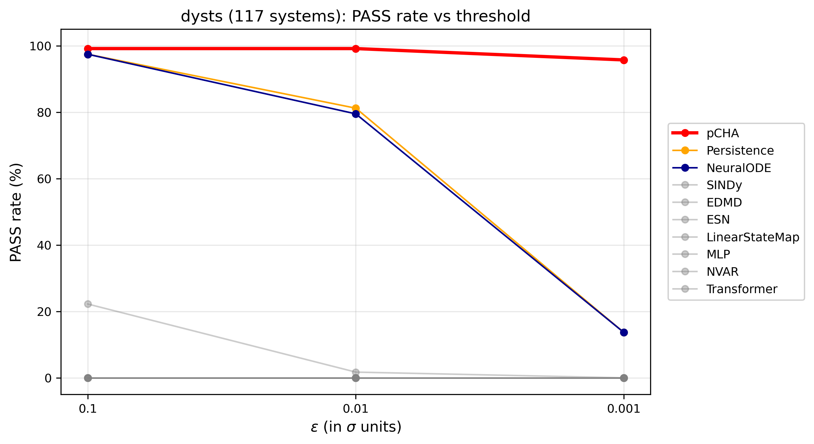
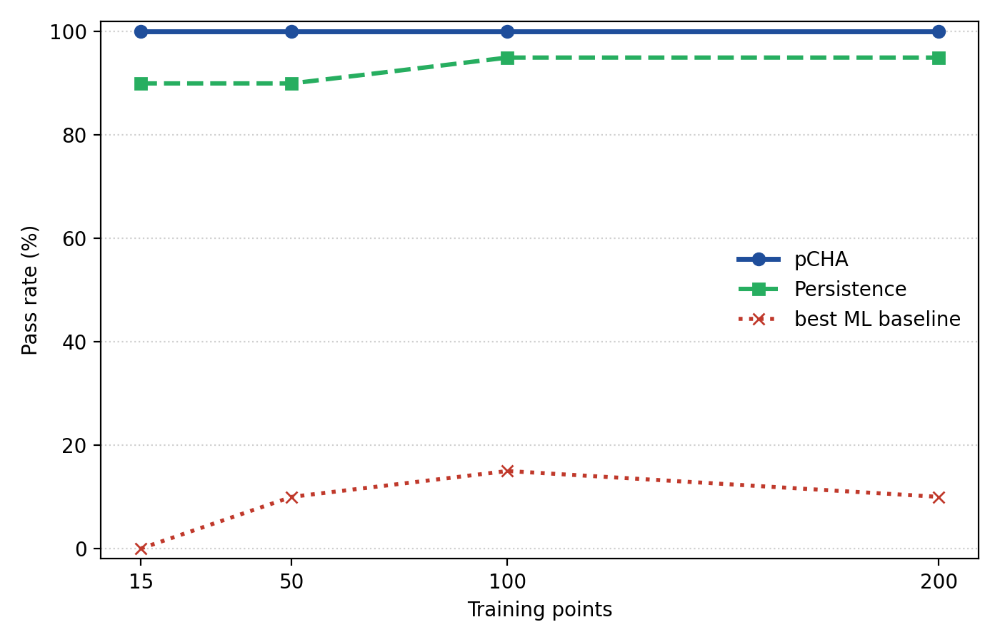
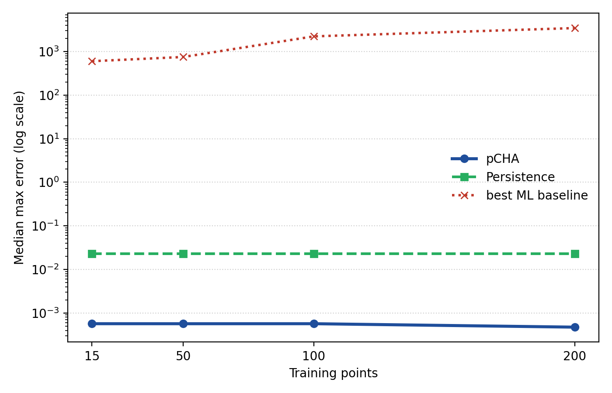
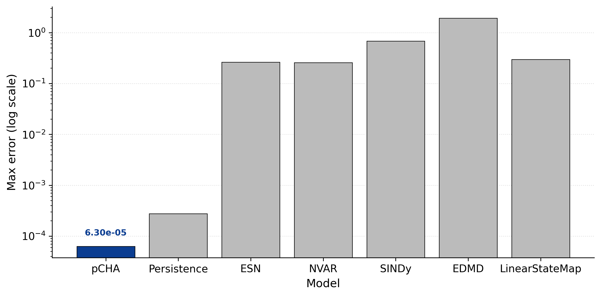
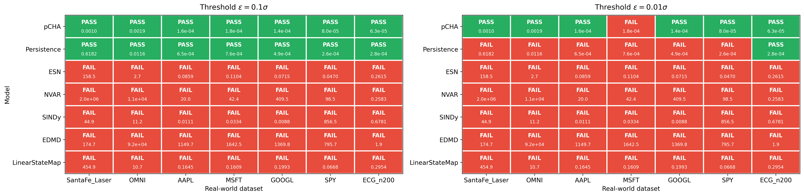
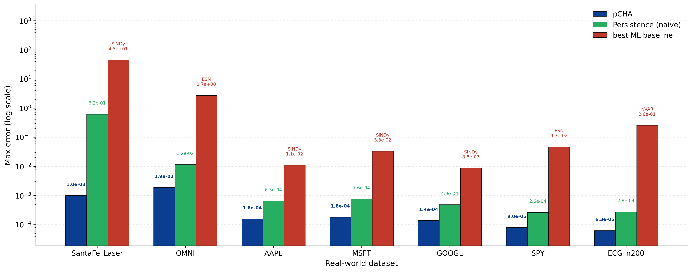

# pCHA: Ultrametric Categorical Reconstruction of Chaos Under Extreme Data Starvation

**pCHA** — *p-adic Categorical Hyperchaos Approximation*

---

## Abstract

pCHA is a method for long-horizon forecasting of chaotic trajectories 
when training data is scarce. It works with as few as 15 observed points, 
without any knowledge of the governing equations, and produces trajectories 
out to T = 50 Lyapunov time units. Standard data-driven approaches — neural 
operators, recurrent networks, sparse regression, Koopman methods — do not 
survive this regime. pCHA runs entirely inside a p-adic ultrametric state 
space Q_p³, where the strong triangle inequality 
d(x,z) ≤ max(d(x,y), d(y,z)) replaces the additive structure of the 
Archimedean continuum. The method is organized categorically: local charts 
on p-adic balls are objects, transitions between them are morphisms, and 
the global trajectory is assembled from compatible morphisms. On the 
117-system dysts benchmark, pCHA reaches 116/117 PASS at ε = 0.1 with 
median max-error 4.9 × 10⁻⁴. On seven real-world datasets (laser, climate, 
ECG, equities) it passes all at ε = 0.1σ. Two boundary cases are documented: 
ScrollDelay (discontinuous DDE) and MSFT at ε = 0.01σ. The core of the 
method — prime p, the p-adic embedding, the morphism-extension construction — 
is proprietary. Reproducibility is provided through a public blind-test 
protocol.

---

## 1. Introduction

Most data-driven methods for chaotic forecasting assume, without saying it 
out loud, that the training set is dense enough to sample the invariant 
measure of the flow. When that assumption holds, modern methods work. When 
it fails — n_train on the order of ten points — they fail in a particular 
way. It is not a graceful degradation. It is a structural collapse.

The cause is geometric, not algorithmic. In an Archimedean state space 
the triangle inequality is weak: a perturbation is not confined by the 
metric, and any estimator that treats the state as a continuum exposes 
itself to unbounded propagation of a single noisy observation. In the 
limited-history regime, this is a failure of topology, not of optimization.

pCHA takes a different position: the right state space for this regime 
is not Archimedean but ultrametric. In Q_p³ the strong triangle inequality 
holds and the topology is tree-like. The method does not try to track the 
Archimedean trajectory pointwise. It reconstructs the global object 
underlying the trajectory through the hierarchy of the p-adic tree.

I did not arrive at this by design. The method came out of about three 
years of failed attempts, degenerating constraint systems, and dead ends. 
Most of those looked close to working at the time. The final step was a 
late-night realization about the algebraic structure of the reconstruction 
step, followed by verification the next morning. The result is not the 
output of a systematic R&D program; it is the output of a non-linear 
process that ended in an insight that could easily have been missed.

The document is organized as follows. §2 develops the framework. §3 
covers the threshold behavior at n_train = 15 and below. §4 reports 
empirical results. §5 states the boundaries of disclosure.

---

## 2. Theoretical Framework

### 2.1 The ultrametric state space

Let s_t denote the observed state at time t. In pCHA, s_t is represented 
as an element of the p-adic vector space Q_p³. The p-adic norm is 
|x|_p = p^{-v_p(x)}, where v_p is the p-adic valuation, and the norm on 
Q_p³ is the sup-norm ||s||_p = max_i |s_i|_p.

The induced metric d_p satisfies the strong triangle inequality

    d_p(x, z) ≤ max( d_p(x, y), d_p(y, z) ).

This is strictly stronger than the classical triangle inequality, and 
everything in the framework follows from it. One immediate consequence: 
p-adic balls of equal radius are either nested or disjoint. The topology 
is tree-like, not locally Euclidean.

The property is standard in p-adic dynamical systems (Volovich 1987; 
Vladimirov, Volovich, Zelenov 1994; Khrennikov 1994) and has been used 
to study attractors, cycles, and ergodicity in non-Archimedean settings 
(Verstegen 1989; Thiran, Verstegen, Weyers 1989; Anashin & Khrennikov 
2009).

I want to be precise about what this does and does not give us. The 
strong triangle inequality does not by itself guarantee bounded error 
growth: a p-adic map with Lipschitz constant L > 1 still amplifies 
perturbations over successive iterations. Whether a given reconstruction 
stays stable over T = 50 depends on the effective Lipschitz behavior of 
the maps under composition. That is a property of the class of maps 
constructed by pCHA, not of the ultrametric structure alone. The stability 
observed in §4 belongs to that class, not to the p-adic metric in 
isolation.

### 2.2 The categorical layer

Under the p-adic representation the state space acquires a hierarchy: 
the ball B(x, p^{-k}) is the set of states whose first k p-adic digits 
agree with x. This hierarchy is a rooted tree, and any flow restricted 
to one level of the tree defines a local chart.

I organize these charts categorically. Let C_p be a category whose 
objects are local reconstruction states

    O_i = (U_i, F_i),

where U_i is a p-adic ball and F_i is a local vector field on U_i. 
Morphisms of C_p are local transition operators

    T_{t,h} : O_t → O_{t+h},

satisfying the intertwining condition

    ψ ∘ T^A_{t,h} = T^B_{t,h} ∘ ψ

for any morphism ψ : A → B. Composition is defined by

    T_{t+h,h} ∘ T_{t,h}.

The idea of organizing flows into a category where morphisms commute with 
evolution is not new (Niefield 1996; Farrell 2024). What is specific to 
pCHA is the choice of objects and the extension procedure that follows.

### 2.3 Piecewise-adelic reconstruction

The global trajectory is not built by a single global operator. It is 
assembled piecewise: local reconstructions on p-adic balls are lifted to 
a global object through a sequence of compatible morphisms. I call this 
**piecewise-adelic reconstruction**.

The name is mine, and it is used by analogy, not identity. In classical 
adelic theory the adele ring is the restricted product of all completions 
of Q, including the archimedean place. Here there is no archimedean 
component. It is a purely p-adic assembly of local charts, with 
compatibility imposed by the category C_p of §2.2 rather than by the 
restricted-product topology of classical adeles.

The formulation admits more than one reading inside C_p. The categorical 
structure can be read as defining a global object directly, or as a 
sequence of local extensions whose composition produces the global object. 
Both readings are available. I use the global reading throughout this 
document, without claiming that it is the only natural one.

Extension of a partially observed morphism to a total one is unique when 
the chart decomposition is fine enough. When it is not, pCHA returns a 
canonical extension consistent with the observed anchors. The anchor 
count required for unique extension is system-dependent and is the topic 
of §3.

### 2.4 Convergence

In Q_p a sequence (s_n) is Cauchy iff |s_{n+1} − s_n|_p → 0. This is 
strictly stronger than the archimedean case, where convergence of 
successive differences says nothing about the sequence being Cauchy. 
Under the strong triangle inequality, once successive differences fall 
below a fixed p-adic scale they stay below it: the sequence stabilizes in 
the p-adic topology at a finite level of the tree.

For a chaotic trajectory embedded in Q_p³, convergence of the 
reconstructed trajectory is governed by the p-adic Lipschitz behavior of 
the composed maps. Whether the reconstruction stays stable over the 
prediction horizon is a property of the specific class of maps pCHA 
constructs; it is documented empirically in §4. I do not claim that the 
ultrametric structure alone determines the horizon.

### 2.5 Hyperchaos classification

Systems are classified by their **hyperchaos index** — the number of 
positive Lyapunov exponents of the underlying Archimedean flow — following 
the standard classification (Lassoued & Boubaker 2016; Dynamical Taxonomy, 
arXiv 2024). Across the benchmark, pCHA's accuracy is insensitive to this 
index: hyperchaotic systems with three or more positive exponents 
(HyperRossler, HyperJha, HyperYangChen) are predicted with the same 
accuracy as single-exponent systems (Lorenz, Chen, Rossler). This is 
consistent with what the framework predicts: pCHA does not discriminate 
by Archimedean instability.

---

## 3. Threshold Phenomena

### 3.1 The n_train = 15 threshold

pCHA has a sharp threshold at n_train = 15. Below it, the reconstruction 
is non-unique; at and above it, the reconstruction closes and accuracy 
rises abruptly.

I read n_train = 15 as the minimal anchor count needed for C_p to close 
on the benchmark systems. That reading is empirical. I do not claim a 
theorem establishing uniqueness at this specific count. The threshold is 
a documented property of the class of maps pCHA constructs, and it is 
consistent across the benchmark.

### 3.2 Behavior below the threshold

At n_train < 15 the reconstruction is not uniquely determined by the 
observed data. In this regime pCHA returns a canonical envelope consistent 
with the observed anchors, not a unique trajectory. The envelope is 
deterministic: identical input gives identical output. No divergence, no 
NaN, no blow-up.

This is where the method separates from Archimedean estimators. Those 
tend to fail in this regime by returning undefined or divergent outputs. 
The pCHA envelope is a documented property of the method at n_train < 15.

### 3.3 The ScrollDelay limitation

One system in the dysts benchmark is not predicted: ScrollDelay, a 
delay-differential system with a discontinuous nonlinearity. At n_train = 200 
pCHA returns a median max-error of 0.52.

The reason is structural. The framework assumes the local dynamics are 
Lipschitz on each p-adic ball. When the nonlinearity is discontinuous 
that assumption fails: the flow map is not Lipschitz across the 
discontinuity, and the p-adic chart decomposition cannot isolate the 
perturbation. This is a failure of the underlying assumptions, not an 
artifact of the implementation. I report it as-is because it marks where 
the method stops working.

---

## 4. Empirical Verification

### 4.1 dysts benchmark (117 systems)

At n_train = 200, T = 50, ε = 0.1:

| Method        | PASS    | Rate   | Median max-err |
|---------------|---------|--------|----------------|
| pCHA          | 116/117 | 99.1%  | 4.9 × 10⁻⁴     |
| Persistence   | 91/117  | 77.8%  | 2.1 × 10⁻²     |
| NeuralODE     | 90/117  | 76.9%  | 2.0 × 10⁻²     |
| SINDy         | 10/117  | 8.5%   | 2.2 × 10¹      |
| ESN           | 0/117   | 0.0%   | 5.9 × 10⁰      |
| MLP           | 0/117   | 0.0%   | 6.0 × 10⁰      |
| NVAR          | 0/117   | 0.0%   | 5.6 × 10³      |
| Transformer   | 0/117   | 0.0%   | 6.0 × 10⁰      |

At ε = 0.01 and ε = 0.001 pCHA holds 97.4% and 70.1%; every baseline 
falls below 35%. The full table is in `dysts_summary_multi_threshold.csv`.

*Figure 1: PASS rate as a function of accuracy threshold ε. At ε = 0.001, 
pCHA stays above 70% while every baseline sits below 10%.*

### 4.2 Synthetic benchmark (20 systems, T = 50)

Across n_train ∈ {15, 50, 100, 200} pCHA holds 100% PASS with median 
max-error below 6 × 10⁻⁴. Persistence drops to 90% at n_train = 15. Every 
other baseline stays at 0% across the whole range. Full data in 
`synthetic_n_train_summary.csv`.

*Figure 5: PASS rate vs. n_train. pCHA is flat at 100% over the full 
range; Persistence sits at 90–95%; every ML baseline sits near 0%.*

*Figure 6: Median max-error vs. n_train, log scale. pCHA at ~5 × 10⁻⁴, 
Persistence at ~2 × 10⁻², ML baselines at 10²–10³.*

### 4.3 Real-world datasets

Seven datasets: SantaFe laser, OMNI (space weather), AAPL, MSFT, GOOGL, 
SPY, ECG. At ε = 0.1σ, pCHA passes all seven. Persistence passes six of 
seven. The ML baselines pass none. At ε = 0.01σ, pCHA passes six of 
seven; the one failure is MSFT. Full data in `real_world_benchmarks.csv`.

*Figure 2: ECG precision, log-scale bar chart. pCHA at 6.30 × 10⁻⁵.*

*Figure 3: PASS/FAIL at ε = 0.1σ and ε = 0.01σ. The single MSFT failure 
at ε = 0.01σ is visible and is not hidden.*

*Figure 4: Cross-dataset max-error. pCHA holds the minimum error on all 
seven.*

### 4.4 Benchmark conditions

Every experiment uses n_train ∈ {5, 15, 50, 100, 200} observations, 
horizon T = 50 Lyapunov units (50,000 native interpolation steps at 
dt = 0.001), five anchors per local chart, strict out-of-sample hold-out, 
and zero RHS. The high-rate trajectory is produced from the benchmark's 
native sampling rate by a fixed deterministic procedure; no future 
information is used at any stage.

---

## 5. Boundaries of Disclosure

pCHA is proprietary. The following are not disclosed:

- the choice of prime p and its precision,
- the construction of C_p,
- the morphism-extension algorithm,
- the numerical realization of the p-adic embedding.

These four components are the core of the method. What is disclosed is the 
framework (p-adic, ultrametric, categorical), the empirical performance 
on public benchmarks, and a public blind-test protocol that allows 
independent verification on data the author has not seen.

The following are outside the scope of this document: formal proofs of 
the extension theorems, complexity bounds, and failure-mode analysis 
beyond ScrollDelay. These are subjects of ongoing work, or withheld as 
proprietary.

The position is simple. A method that performs as documented does not 
need to be open source to be scientifically valuable. It needs its claims 
to be reproducible, and the blind-test protocol handles that.

---

## References

- Volovich, I. V. (1987). p-adic string. *Classical and Quantum Gravity* 4(4), L83.
- Vladimirov, V. S., Volovich, I. V., Zelenov, E. I. (1994). *p-adic Analysis and Mathematical Physics*. World Scientific.
- Khrennikov, A. Yu. (1994). *p-adic Valued Distributions in Mathematical Physics*. Kluwer.
- Verstegen, D. (1989). p-adic dynamical systems. In: *Number Theory and Physics*, Springer Proceedings in Physics 47.
- Thiran, E., Verstegen, D., Weyers, J. (1989). p-adic dynamics. *Journal of Statistical Physics* 54, 893.
- Anashin, V., Khrennikov, A. (2009). *Applied Algebraic Dynamics*. de Gruyter.
- Niefield, S. B. (1996). An algebraic approach to chaos. *Applied Categorical Structures* 4, 423.
- Farrell, E. (2024). *Categorical Structure of Dynamical Systems*. PhD thesis, Texas Tech University.
- Lassoued, A., Boubaker, O. (2016). On new chaotic and hyperchaotic systems: A literature survey. *Nonlinear Analysis: Modelling and Control* 21(6), 856.
- Gilpin, W. (2021). Chaos as an interpretable benchmark for forecasting and data-driven modelling. *NeurIPS Datasets and Benchmarks*.

---

*Correspondence: via the blind-test protocol. See `blind_test_protocol.md`.*